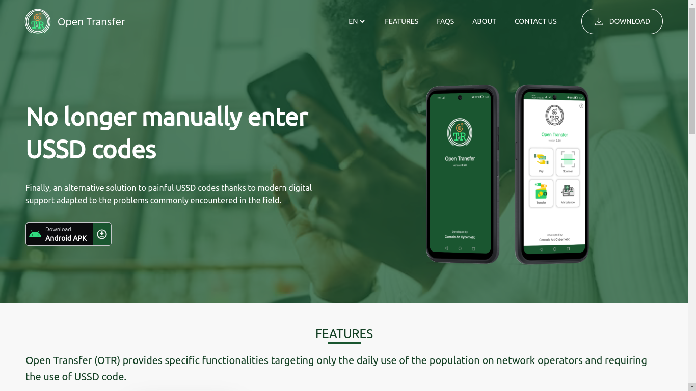
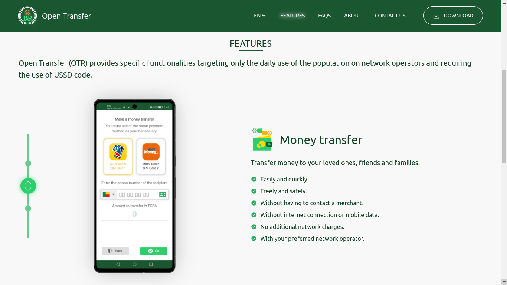
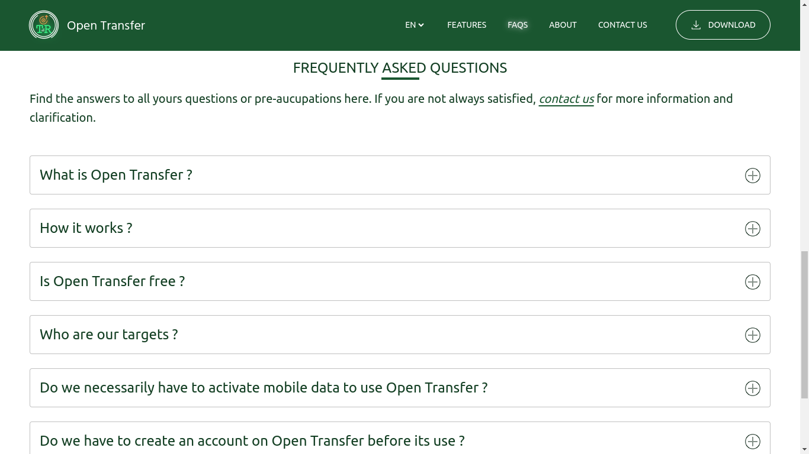
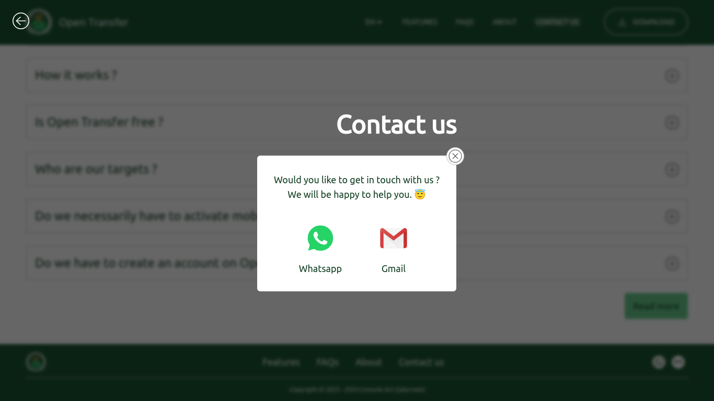

# Open Transfer


Open Transfer is a standalone mobile application 
designed to exempt citizens being under a network 
operator to manually enter codes USSD to carry out 
their daily tasks in offering them a digital 
solution with the aim of to automate the 
composition and launch of USSD codes.

## Table of contents
1. [Access links](#links)
2. [Final result](#result)
3. [Project installation](#install)
    1. [Nodejs installation](#node-install)
    2. [Sources code cloning](#cloning)
    3. [Dependencies installation](#dev-install)
    4. [Project execution](#running)

## Access link <a id = "links"></a>
The official website of Open Transfer may 
be accessible via the link below :<br/>
- https://cacybernetic.github.io/opentransfer

## Final result <a id = "result"></a>
This is the final result of the project :<br/><br/>





## Project installation <a id = "install"></a>
⚠️ This project uses <i><a href = "https://vitejs.dev/guide/">
Vite</a></i> bundle as javascript server + <i><a href = "https://react.dev/">
React</a></i>. Before run the project, you must install
<i><a href = "https://vitejs.dev/guide/">Vite</a></i> 
and <i><a href = "https://nodejs.org/en">NodeJS</a></i>.

### Nodejs installation <a id = "node-install"></a>
```sh
cd ~;\
sudo apt install curl;\
curl https://raw.githubusercontent.com/creationix/nvm/master/install.sh | bash;\
source ~/.bashrc;\
nvm --version;\
nvm install --lts;\
node --version;\
npm install yarn --global;\
yarn --version
```

### Sources code cloning <a id = "cloning"></a>
```sh
git clone git@gitlab.com:console_art/otrws.git open_transfer/
```

### Dependencies installation <a id = "dev-install"></a>
Go to the root folder of the project sources
and run :
```sh
yarn install
```

📔<ins>Note</ins> : <i><a href = "https://vitejs.dev/guide/">
Vite</a></i> and <i><a href = "https://react.dev/">
React</a></i> will be installed automatically
after running the command line above.

### Project execution <a id = "running"></a>
Go to the root folder of the project and run :
```sh
yarn run dev

```
Then, open your favorite browser and tap on
the search bar, the following link below :
```sh
http://localhost:5400/
```

Enjoy :)
